# 9/15 Project Proposal Work

### Objective

The objective for today is to finish the project proposal and have a good idea of everything we need to build and design in order to get the final product of a robot out and working

### What was done

Today, I focused mainly on working on the hardware subsystems and anything that mainly concerned the PCB.

I first started working on the power subsystem. That means making sure our battery can handle all the power draw from the motors. After consulting Jeevan for the power draw of the motors, I used equations from [Battery University](https://batteryuniversity.com/) to figure out of the selected battery we had would have enough capacitance and energy to last a 2 minute fight. After that was confirmed: 
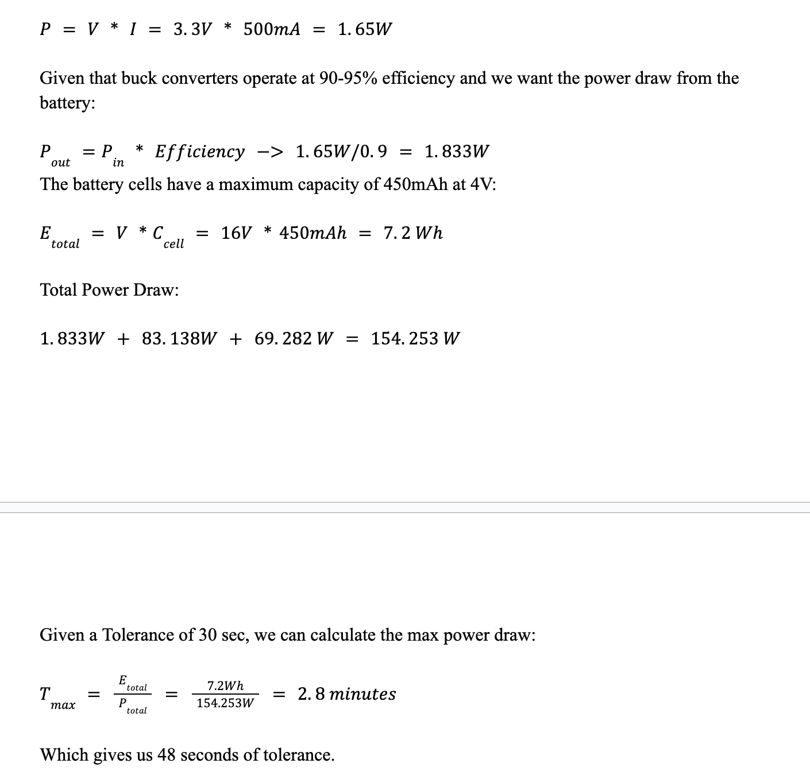

I started thinking about what all power conversion systems we would need. First, I needed to understand what all systems would need what all power. We have an ESP32S3 using 3V3, and a bunch of motor drivers using 16V, so I just need 1 16V-3V3 buck converter. From prior experience, I knew some buck converters that would work, and given the big voltage drop, I knew a linear regulator would heat up too much because of the power loss. 

After that, I started working on which motor drivers we would need. Given the complexity of a creating a 3 phase AC current from DC current, I knew we would need a chip that would be able to take care of as much of the process as possible. I found the MCF8316A chip.
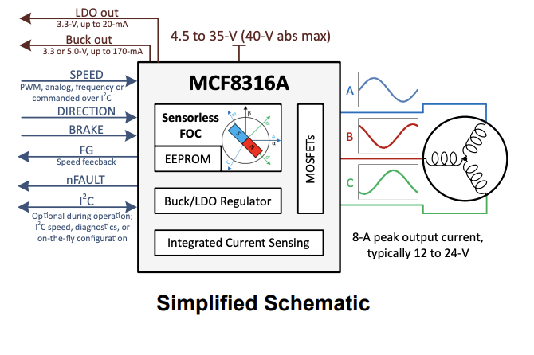
This chip handles the 3 phase output with just a PWM frequency, which is perfect for our applications. The main downside is that there is a current limit of 8A. Our weapon motor can have a higher power draw than 8A, so I found a very similar TI chip that only generates the pwm for the gate driver so we don't have to worry about the current limit, the MCF8329A.
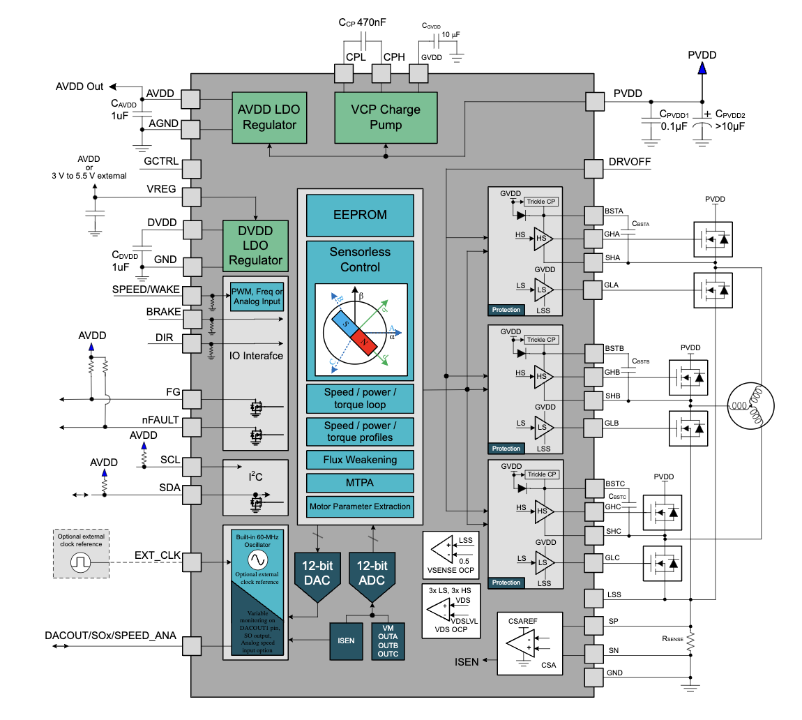. 
This means that we can get any mosfets that are rated for above 40A, so for the design doc I'll keep that in mind.

This concludes everything I worked on for the Project Proposal and all the decisions I made.


# 9/30 Design Document Work

### Objective

For this session, I need to work on all the hardware requirements/subsystems for the design document. This means getting part numbers, getting actual schematics and making sure that all the criteria is met for my specific subsystems.

### What I worked on

For the power subsystem, I first tried to find a buck converter that would fit the requirements for our RV table. I knew that we woud need a beefy buck converter and some undervoltage protection. After outlining the main RV tables (stable power conversion, enough battery life for the robot, and safety), I found the buck and resulting schematics. The part is LM2596:
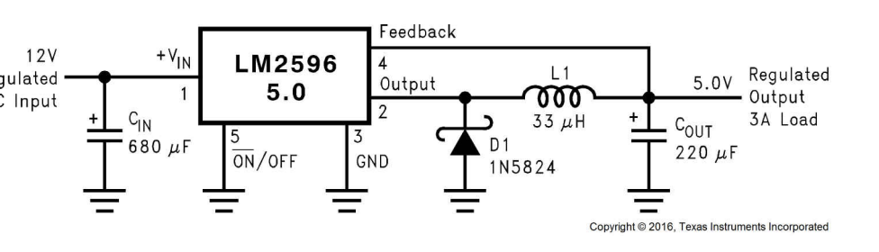
This buck gives either 5V or 3V3 output, so I referenced the table in the [datasheet](https://www.ti.com/lit/ds/symlink/lm2596.pdf?ts=1732847766696&ref_url=https%253A%252F%252Fwww.mouser.com%252F). I was able to find the correct capacitor and resistor values so that in the future, when I design the circuit, I'll know exactly what to put. I also found this undervoltage protection circuit:
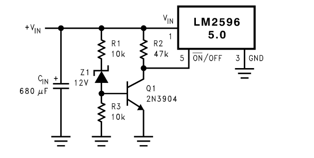
that can meet our safety requirements.

After settling on the power subsystem and battery, I worked on the drive subsystem. The main thing with the MCF8316A is following the datasheet for the schematics. I wrote the justification on how this chip will require the least amount of work and would still be able to meet all the requirements for the drive system we laid out. For the RV table, I think the main requirements that are fair are accuracy in the request throttle and actual throttle and then having the ability to provide peak RMS current of 8A.

After writing the justification and the RV table for the drive system, I started working on the weapon subsystem hardware. Because the chip I found (MCF8329A) is only a gate driver chip, I needed to find some mosfets that are able to handle a peak current of 40A. After some reseach I found some MOSFETs (`CSD18536KCS (200A, 60V)`) that I could create a 3-leg H-Bridge from. For the RV table, the main things with this subsystem was being able to actuate the weapon motor and control its speed.

# 10/12 PCB Design

### Objective

For this work session, the main goal was to get 2 PCBs designed for the order date. 

### What I worked on

We have 2 main PCBs that we are thinking we'll need:
- Controller PCB: Has the ESP32S3 and the buck converter for the 3V3 power. This will connect with our remote and send the signals to the driver PCB to control the motors
- Driver PCB Has the 2 motor drivers and the 1 gate driver, and receives signals from the controller PCB

I designed the controller PCB first with a lot of test points and made sure to follow the ESP32S3 [Datasheet](https://www.espressif.com/sites/default/files/documentation/esp32-s3_datasheet_en.pdf) for the schematics and layout. The final product came out as such:
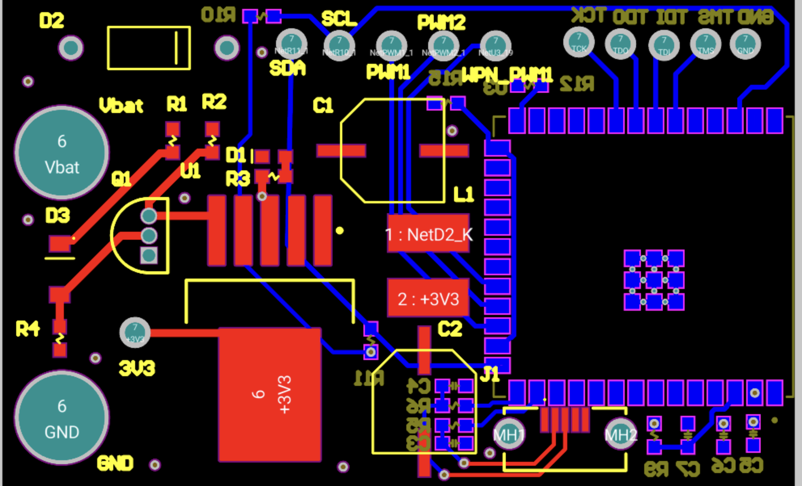
I added a lot of test points to make sure it would be easy to test. After designing this PCB, I realized that the buck converter I found might be too big. On top of that, we got the Dev board and we could only flash through UART and not USB. So after ordering, we decided to make these changes for RevB:
- smaller buck converter
- be able to flash using usb instead of uart

For the driver pcb, for RevA, I couldn't find a good way to fit all the mosfets and the 3 chips in the constraints for the PCB, so I decided to make a test board only for the MCF8316A. I added testpoints and only made the schematics and PCB for 1 chip to use as a tester:

One of the major things I noticed was that the resistor we used for the buck converter was really big, and we don't even use the buck converter, so depending on the test results, we might reduce the size.

# Considerations After Designing

After reading the MCF8316A datasheet, we realized we need to control the chip using PWM, and can't use I2C, we can only use I2C to configure the chip. On top of that, after flashing with the dev board, we need a UART bridge on our next PCB. We also found a smaller buck converter: `LMR50410Y3FQDBVRQ1`. This chip is a lot smaller and allows for smaller components. On top of that, we found a UART bridge: `CP2102N`, which is from the dev board datasheet. These created a lot of changes for the RevB schematics and PCB for the controller PCB.

After doing some testing on the motors well, we found that the peak current draw for all the motors is 4A, and that we won't actually need the MCF8329A chip. This allows us to cut a lot of big parts like the MOSFETs. We could also size down the battery from a 450mAh battery to a 300mAh battery because of the reduced current draws. 

```Test results: motor_test_results.MOV```

Another major thing I learned while reading the MCF8316A datasheet was that all the chips share the same slave address of `0x01`, and they can't be edited. Either we have 3 separate I2C buses, which isn't possible with the ESP32S3, or we use an I2C mux. I decided to search up some I2C muxes and found the `TMUX131`. This has 3 bidirectional ports that we can mux and send to each motor driver.

# 10/19 Software Development

### Objective

Start building out the drivers for the motor to be able to just control the motor via 1 PWM signal that is given from our bluetooth code. The bluetooth code is being handled by Keegan, while the motor code is handled by me. 

### What did I work on

I started building out the drivers using the ESP32S3 datasheet and the MCF8316A to use the right libraries make sure I was sending the correct I2C messages and PWM duty cycle to the chips. One of the biggest considerations was using the i2c_esp library for ease of use, and I only needed to write a couple messages to configure the registers. I found that the main message I needed to send was the config register for the speed pin to configure it to be a PWM pin using the datasheet. I also found all the libraries using the ESP [coding guide](https://idf.espressif.com/).

The structure for the code is:
```
main
|-includes
    |- mcf8316a.h
    |- mcf8316a_config.h
    |- i2c_esp.h
    |- adc.h
    |- pwm.h
|- adc.
|- i2c_esp.c
|- main.c
|- mcf8316a.c
|- pwm.c
```
Where `main.c` has the main while loop running the code. The pwm, adc, and i2c files are drivers to setup/configure the right pins and send the correct output. The `mcf8316a.c` file has an array of structs that has the status for each motor. The main loop would call the bluetooth function to update the motor structs and then call the correct pwm/adc pins to control the motor.

When I tried to flash the code to the dev board, none of the pins would work, but the code would be able to flash properly. After a lot of work, I decided that maybe I start with the Arduino IDE. I started by just coding the PWM pins on Arduino and got it working. Here are the test results from the PWM code:
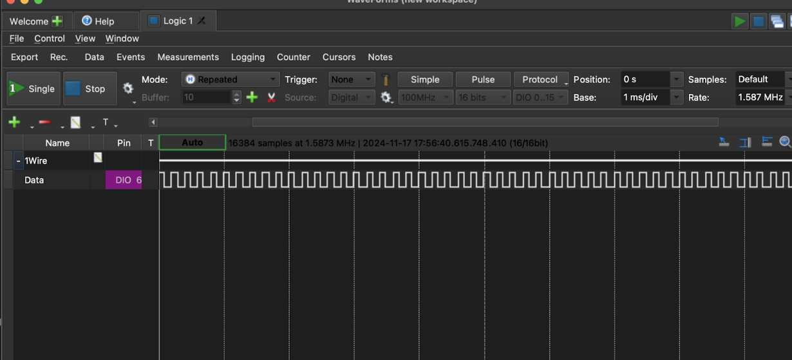

# 10/28 PCB RevB Development

### Objective

Get Rev B PCBs done for Rd 4.

### What work I did

I started redesigning the controller PCB for RevB. Looking back at the design considerations and everything else required, we decided to meet the goals of the project and reduce overhead, we removed a lot of the GPIO pins necessary on the controller board and then shrunk down the buck converter. I also decided to follow the UART bridge schematics on the dev board. 
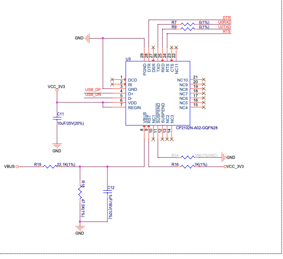
I used the [LMR50410Y3FQDBVRQ1](https://www.digikey.com/en/products/detail/texas-instruments/LMR50410Y3FQDBVRQ1/13562985) datasheet and the following schematics:
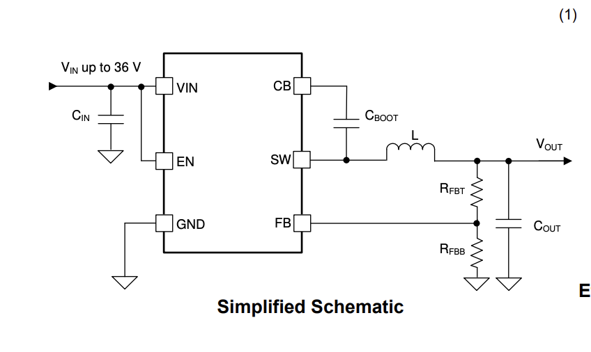
as part of the new RevB board. The smaller buck made it easier to fit all the components. Also removing all the unnecessary GPIO was helpful in making the PCB.
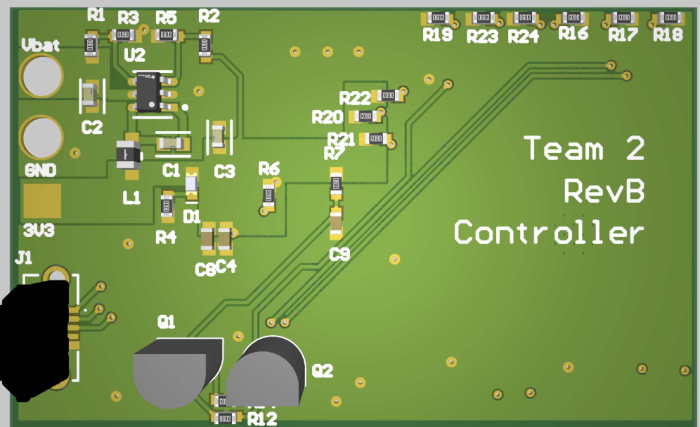
I replaced the test points with pads to make the spacing better in the PCB as well. Overall the revB controller PCB came out pretty well, and after removing all the unnecessary components, the design was a lot easier to fit within the 1"x2" constraints. 

I also worked on the revB for the driver board. After the design considerations I discussed above, starting with the mux. I added the I2C MUX which was discussed above using the TMUX131 [datasheet](https://www.ti.com/lit/ds/symlink/tmux131.pdf?ts=1732905607679&ref_url=https%253A%252F%252Fwww.ti.com%252Fproduct%252FTMUX131). The I2C bus from the ESP32S3 comes to the driver board and then splits to the 3 motor driver chips as such:
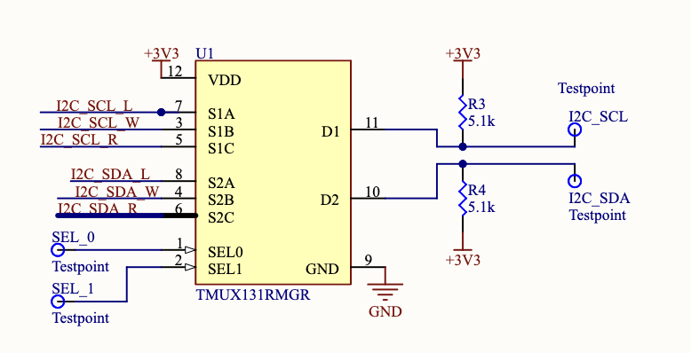
I then changed up the schematics from revA to be easier to edit. Because we need 3 `MCF8316A` chips and don't need the MCF8329A, I decided to make a heirarchical circuit system. That way I only need to make edits to 1 schematic and all the chips will be edited. I shrunk the size of the feedback resistor on the buck after testing and analyzing that the output from the buck is still same with or without the feedback resistor. Similar to the controller pcb, I changed all the test points to pads to save on space. Because all of the circuits were repetitive, the design was pretty straight forward. I ran power through the bottom and then have the decoup caps on the same layer as the chip so that the power is as stable as can be. The RevB PCB came out pretty well:
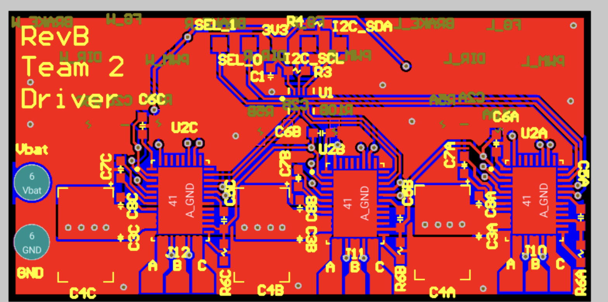
I tried to use as many polygons as possible for the power connections.

# 11/17 SW Integration Work

### Objective

The objective for today is to make the pwm and bluetooth code work together. To this, we have the motors and the robot, and we have some off the shelf ESC's and the dev board for the ESP32S3.

### What I worked on

I ported over the PWM code into Keegan's bluetooth code. Taking the direction and throttle that he was able to calibrate and calculate from our remote controller, I wrote a transfer function to calculate the PWM duty cycle necessary to properly controller the ESC's. This required measuring the PWM output from an OTS controller we had. We used a scopy to get the different duty cycles for different throttles. After that, we could write the transfer function.

After that, we started testing, but we realized that there was an arming procedure to get the ESC to work. We needed to send full throttle right off the bat. After that, we were able to control all the motors remotely from our controller. Keegan wrote a lot of the bluetooth code, but the main things we achieved was:
- arming procedure for OTS ESCs
- our custom bluetooth and pwm code works in controller the motors
- we were able to have a standalone robot moving from out controller using OTS PCBs and custom software

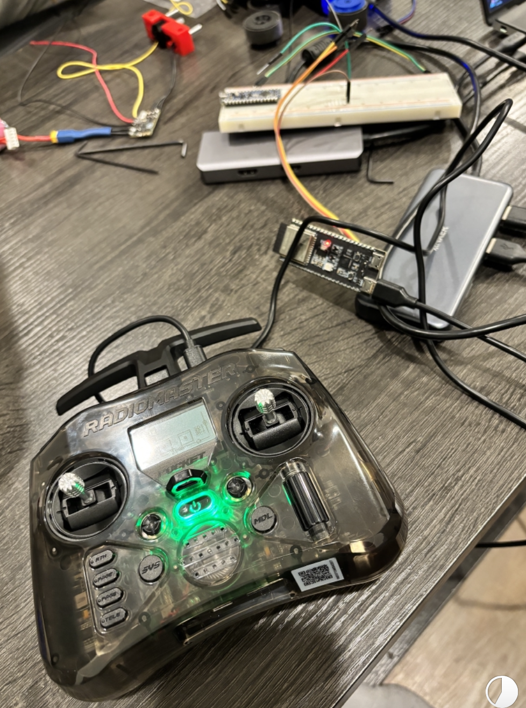


# 11/21 Driver PCB Verification

### Objective

The objective of today is to make the revB driver PCB to work properly. We ordered it premade on JLC to be able to speed up testing.

### What was achieved

Me and Keegan wrote the I2C driver and PWM driver on arduino in order to be able to send the correct configuration to the MCF8316A. After getting the I2C driver to send the write messages, verifying using a scopy, we started sending the I2C messages.

We realized that the ACK from I2C was not being received, and that it could likely be due to the chip being in sleep mode. After reading the datasheet and doing more research, we tried sending digital high to the speed pin because that would put the chip in the wake mode. The problem is that the chip would still not be in the wake mode, and on top of that, the voltages were messed up. We couldn't debug much outside of that. We tried on a new PCBA and were able to get the chip to wake up and configure it with I2C and actuate the motors using PWM duty cycle. We had to play around with the PWM that we sent to first be 100% duty cycle to ARM the motors and then finally were able to control the motors.

# 12/2 Controller PCB Soldering

### Objective
Solder and test the controller PCB revB that came in.

### What was achieved

Me and Keegan soldered up the controller revB PCB and then were able to test the 3v3 buck to make sure it met the spec sheet. We didn't run into many problems with this outside of it taking a lot of time.

PCBA:
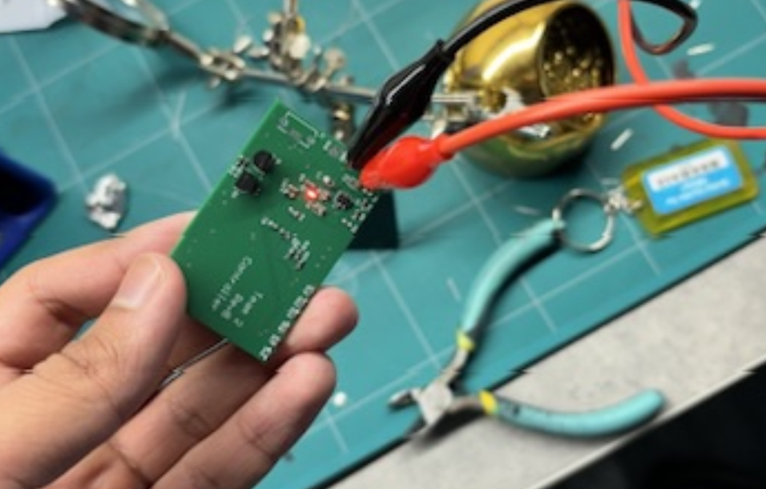

3V3 Test:
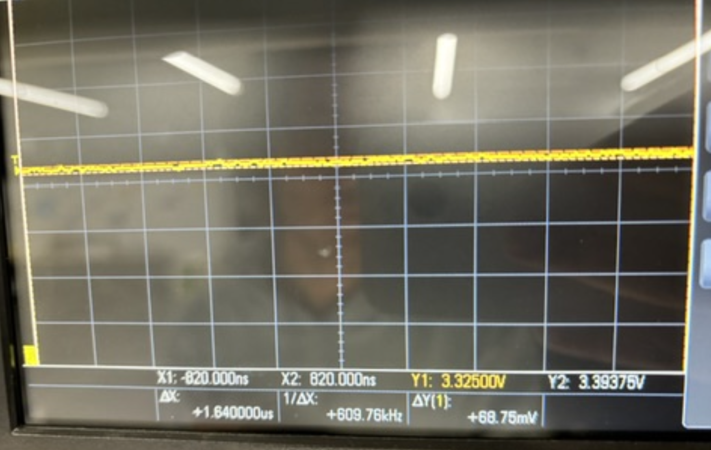

# 12/3 Robot Integration

### Objective
Test the software and integrate all the components in the robot for the demo.

### What we achieved
Keegan was able to get the software working and flashing on the controller PCB, which was pretty straight forward so we were able to send I2C and PWM messages to our driver PCB and control the motors, which ended up being the majority of our project. After this Jeevan worked on integrating the electronics with the chassis and packaging it professionally for the demo.

After that, we conducted any tests we needed to demonstrate us meeting our high level requirements. Jeevan and Keegan talk more about that in their lab notebooks.