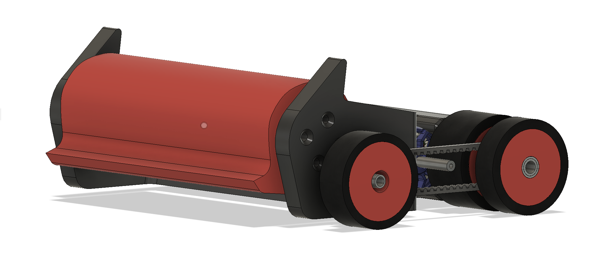

# Jeevan's Work Log

# Table of Contents
- [Meeting 1: Background Research](#m1)
- [Meeting 2: Coming up with a design](#m2)
- [Meeting 3: Starting with Design](#m3)
- [Week 4: Feedback/Issues with Version 1](#m4)
- [Week 5: Design for Version 2](#m5)
- [Week 6: Feedback/Issues with Version 2](#m6)
- [Week 7: Design for Version 3](#m7)
- [Week 8: Feedback/Issues with Version 3](#m8)

## Meeting 1: Background Research 
As a team we have decided on pursuing the project that was pitched by Professor Gruev which was the antweight battlebot competition. It seemed like a lot of fun as 
we have all watched the battlebots show before and this would be like a smaller version of the real competition. I have also competed in a similar competion but I 
created a 3lb robot, so this would be very similar in some ways. There were a few major differences between the competition I competed in, and the comeptition that 
Professor Gruev is hosting.

1. The robots will have a maximum weight of 2lbs
2. All parts must be 3D printed out of PLA, PLA+, PETG, or ABS.
3. All PCBs must be custom and cant utilize any off the shelf ESCs
4. Must use a Microcontroller inside of the robot that will communicate with a computer via bluetooth or wifi
5. Maximum voltage is limited to 16V

After reading the rules, we realized that there are three main components for this project, the phsyical design of the robot, the ESCs that will power the motors, 
and the Microcontroller and communication with the robot. Given our strengths and previous experience, we split up the three parts where I will work on the robot design, 
Keegan will work on the software, and Avik will work on the PCB's, but we will all help out with other parts when possible and help is needed to meet deadlines.

With the roles assigned, we decided to split up and start working on our own parts.

## Meeting 2: Coming up with a design
Being in charge of the mechanical design of the robot, I wanted to do something that would be cool and effective. From past experiences building larger robots, a vertical
spinner seemed to be the most effective style of weapon where they usually try to get under the other robot and throw them into the air. This causes them damage whey they
fall and hit the ground. The other optioins were a hammer bot, and a horizontal but these didnt seem viable due to to the printing and manufacturing constraints.

Our inspiration is the image below:

This robot seemed to be a complete representation of all the characterisitics of the robot we wanted and a good baseline of what we wanted to achieve.

## Meeting 3: Starting with Design
We started with a design and the cad is shown below:

After working on the robot, we realized that the robot would be a lot over the initial weight limit we were hoping to hit of 1lb, as that is the weight of most of the competions
that are hosted at other places. With this we realized that our compartments would have to be reduced drastically and the robot cant have a lot of solid parts.

## Meeting 4: 

After spending some time re-evaluating the design, we realized that 

