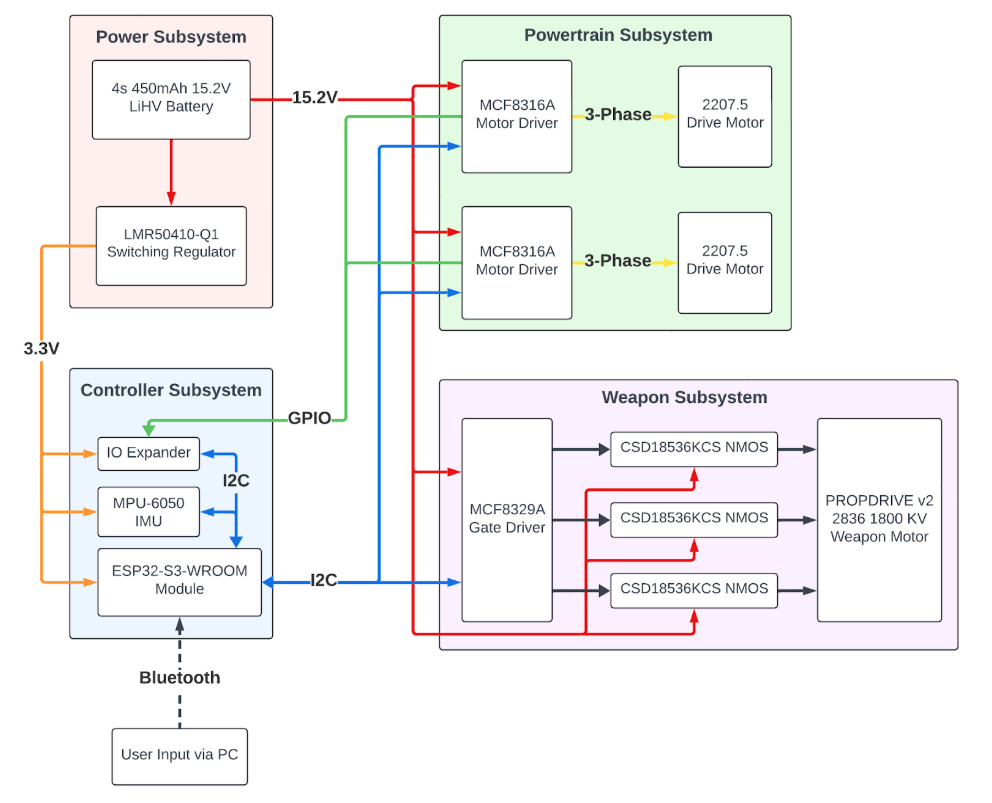
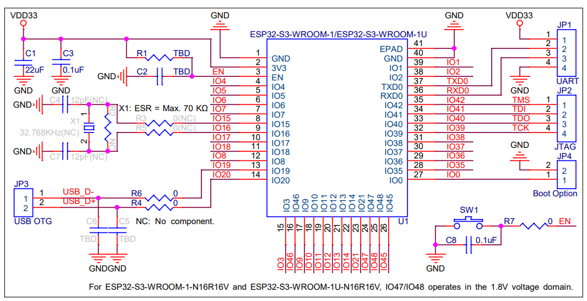
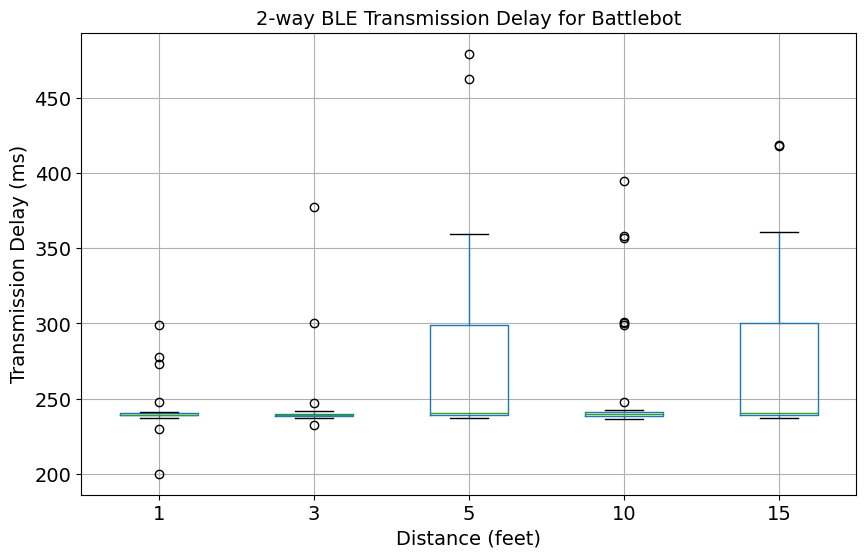
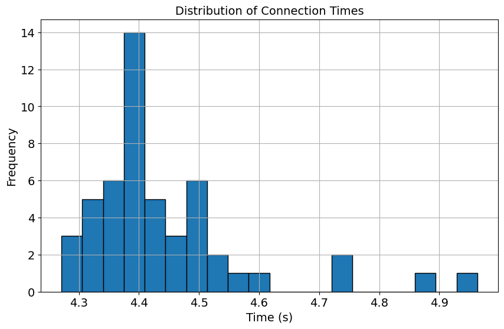

# ECE 445 Lab Notebook
Keegan Teal, Team 2

# 9/17 TA meeting and project proposal

We met with Jason (TA) to discuss our project and get some feedback on our project proposal document. We realized we needed to include some more reasoning and justification for the project into our proposal. Although we are doing a pitched project, there are still requirements for the competition that we need to discuss and include.

For the project proposal, I was responsible for the controller and part of the weapon electrical subsystems. After looking at data on different microcontrollers, we decided to use the [ESP32-S3-WROOM-1U](https://www.espressif.com/sites/default/files/documentation/esp32-s3-wroom-1_wroom-1u_datasheet_en.pdf), which would simplify our implementation of wireless communication protocols. It also has capabilities for I2C, SPI, and GPIO, which we will need for our peripheral chips.

To add live telemetry, we're including an IMU to measure acceleration and verify our high-level requirements. The IMU we're planning to use is the classic [MPU-6050](https://www.adafruit.com/product/3886), which I have worked with before. It is a 6-axis accelerometer and gyroscope that can be used to measure acceleration and angular velocity. We will use this data to verify our acceleration speeds and display live data on how our robot is performing.

Avik and I also discussed the weapon electrical subsystems. He was able to find integrated BLDC motor drivers for the drive system as well as a gate driver for the weapon system, since it draws ~40A of current. We are planning on using brushless DC motors for both the weapon and drive systems, which will require us to generate 3-phase AC current instead of the simple DC current that our ESP32 can drive.

Finally, I worked on the tolerance analysis for the drive and weapon systems. The first main hurdle was finding if the motors we chose were capable of driving the wheels at our necessary RPM with our tangential drive. Since our motor has a shaft diameter of 7mm and our wheel has a diameter of 25mm, I can use simple geometry to find the necessary RPM. We are aiming for a 3m/s top speed:

$$\frac{3m/s}{0.025m \cdot \pi} = 38.2 \text{ RPS} \cdot \frac{60s}{min} = 2291.82 \text{ wheel RPM } \cdot \frac{0.025m}{0.007m} = 8186 \text{ motor RPM}$$

We require a motor that can drive at 8186 RPM to meet our high level requirements, and since our motors have an 1800 KV rating, we need to drive our motors at $\frac{8186}{1800} = 4.55V$, which is far below our planned $16V$ battery.

I also used a similar equation (without the tangential drive gearing) to find the necessary RPM for the weapon system. We are using a 60mm diameter weapon and are aiming for a 150mph (67.056m/s) tip speed, which requires a mtoor RPM of $\frac{67.056m \cdot 60}{0.060m \cdot \pi} = 21344.59 \text{ RPM}$. To drive that at $16V$, our minimum KV rating should be $\frac{21344.59}{16} = 1334$ KV. We were able to find a [brushless DC outrunner motor with a KV rating of 1800](https://hobbyking.com/en_us/propdrive-v2-2836-1800kv-brushless-outrunner-motor.html), which more than exceeds our requirements.

# 9/31 TA meeting and design document

We again met with Jason to talk about what is necessary for our design document. Due to other course conflicts, none of us were able to work on the document for our meeting, but Jason showed us some example design documents from previous years.

For the design document, I was tasked with creating the block diagram, the controller subsystem, and the cost analysis.

The block diagram was created using [draw.io](draw.io):

The different subsystems each serve a purpose, and the block diagram helps show how they are all connected together.

For the controller subsystem, I discussed the ESP32-S3-WROOM-1U microcontroller and how it will be used to control the robot. I also discussed the IMU and how it will be used to measure acceleration and angular velocity. The controller subsystem will also be responsible for sending telemetry data to the operator.

The specific ESP32-S3 model we are using also came with some schematics for peripherals in the datasheet:

I also found a [shunt resistor](https://www.digikey.com/en/products/detail/littelfuse-inc/SSA2512L0M20FPR/21531620) that will allow us to monitor current draw using the ESP32's ADCs and ensure that we are not exceeding a safe limit.

The off-board user input will be decided later, once we have a better idea of what we need to use. I have a drone controller that I can use to control the robot, but we may also implement a custom controller if we have extra time.

For the cost section, I simply found all our required parts online and added up the component costs. Our total cost is $174.82. With 90 hours of estimated labor at $60/hr, we also have $5,400 in labor costs. Our total cost is $5,574.82.

# 10/8 Parts ordering

For this week, Avik designed the PCBs with some of my assistance. I then created a BOM and finalized exact parts to submit our order on Digikey through the ECE purchasing department. We also ordered all non-component parts that we are planning on using (filament, motors, and battery).

# 10/15 TA meeting

We met with Jason again and ordered our first revision PCBs. We intentionally decided to make these not our final revision, as we are still unsure about how to properly interface with the MCF8316A and MCF8329A motor drivers. We plan to order again at week 2 or 3.

We also decided that due to time constraints, we will be using my existing drone controller. I have the [Radiomaster Pocket](https://www.radiomasterrc.com/products/pocket-radio-controller-m2), which should be able to control our robot as long as I account for it in the external controller.

I also ordered an ESP32-S3 dev board off of Mouser to test with. This is our backup plan in case the custom PCBs do not come in time, and it will also allow us to test our code before the PCBs arrive.

# 10/22 Meeting

Our PCBs have not arrived yet, and it seems like there will likely be delays. I began looking at different options for interfacing with the user, and a Python script running on an external laptop will be the easiest option. This is because of existing BLE libraries (`simpleble`) and the ability to easily interface with the Radiomaster Pocket controller.

# 10/31 PCBs arrived

The PCBs have arrived, and I have begun soldering the components onto the board. I have also been helping Avik with the ESP32 code, since we are both familiar with embedded C development. Due to the late arrival of the PCBs, we are cutting out the IMU and external peripherals in an effort to make sure that our MVP is functional. We are also only using the MCF8316A motor driver for the drive and weapon subsystems, since after testing current draw we found that the MCF8329A was not necessary. The weapon motor draws <5A under full load, so this falls well within the capabilities of the MCF8316A (8-A peak).

I had to learn how to use a PCB stencil and reflow oven to solder the MCF8316A motor drivers, as they are QFN packages. I also used a hot air gun to solder the ESP32-S3, since there are ground pads underneath the chip that need to be soldered. This was quite successful, and after continuity testing I was able to confirm that the board did not have any shorts and was soldered properly.

# 11/14 Software development

Today, my goal was to use our dev board and my laptop to build out code for the BLE connection. I settled on using BLE due to the low latency, simplicity, and ease of use.

First, I had to read through the [ESP-IDF documentation](https://github.com/espressif/arduino-esp32/blob/master/libraries/BLE/src/BLEDevice.h) to understand how to set up a BLE server. I struggled with this for a while, since the documentation is not very clear and mostly just consists of header files with docstrings. I eventually was able to detect the server using [Bluetooth LE Explorer](https://apps.microsoft.com/detail/9n0ztkf1qd98?hl=en-US&gl=US) on Windows, which is a program that I had never used before.

Then, I had to write the client for the server. This was quite difficult, as I had to try multiple different Python libraries. The main difficulty I faced was that most libraries are configured to handle "Bluetooth Classic", while we were using "Bluetooth Low Energy". This meant that most documentation online was not useful to me. I eventually settled on using the `simpleble` library, which was able to connect to the server hosted on the ESP32-S3 and set up a `Hello World!` client-server ping-pong.

Another major hurdle that I faced was that it is very difficult to pipe Bluetooth adapters into the Ubuntu WSL2 environment. I typically do all software development in Linux on my WSL2 instance, but I had to switch to using Windows for this project. Using the NT kernel is not ideal, but when working with Bluetooth it is much easier than attempting to pipe the Bluetooth adapter into WSL2. In order to use Windows properly with `simpleble`, I had to enable multiple runtimes and different concurrency mechanisms, since the library operates with async callbacks.

Once I was able to get the client and server to communicate, I began working on the control system. I decided to use Pygame to interface with the controller, since I could put the controller into a mode that forces Windows to treat it as a USB joystick. This made it fairly trivial to read the controller inputs and send them over BLE to the ESP32-S3. I created a custom `struct` in the ESP32 code, and encoded bytes into this `struct` to send over BLE. I then decoded the bytes on the ESP32 side and used them to output over the serial port. Once we integrate PWM control, I will be able to use these values to set the duty cycle of the PWM pins to control the motor drivers.

# 11/15 Simulator

I began work on a basic Pygame driving simulator for our robot that will allow us to test our control algorithms without needing to connect to the robot. I used the same control scheme as the controller, and was able to get the robot to move around the screen. I also added a simple physics engine with `Pymunk` that simulates the robot's movement and acceleration. This will allow us to test our control algorithms and make sure that the robot moves as expected.

# 11/17 and 11/21 Software integration

I worked with Avik to integrate the PWM control into the ESP32 code. We were able to use the values sent over BLE to set the duty cycle of the PWM pins, which control the motor drivers. To do this, we used an Analog Devices ADALM2000 and Scopy, tools from our ECE 120 class, which allowed us to both decode the digital I2C signals and output analog PWM signals.

Once we were able to verify that our PWM signals were changing appropriately, we were initially puzzled by why the MCF8316A motor drivers were not responding properly. We quickly realized that we needed to initialize the motor drivers by sending a "pulse" of 100% duty cycle to the "Speed/Wake" pin. This was documented in the datasheet, but we had missed it in our initial readings. Once we implemented this initialization phase before sending control messages, we were able to get the motors to spin. This was a huge milestone for our project and validated that our Python script, BLE interface, and ESP32 code were all working together.

# 12/2 Controller PCB assembly

Avik and I soldered the controller PCB using the PCB stencil and reflow oven. While we had ordered a stencil for our PCB due to the QFN and BGA packages, we forgot to specify which side of the PCB the stencil was for, and so we got it for the wrong side. This meant that we had to manually solder the ESP32-S3 and CP2102 USB-to-UART bridge, which was quite difficult. I accomplished this by using the solder paste tube and a scraper, then placing in the reflow oven. On our initial attempt, the ESP32-S3 shifted in the oven, but I was able to adjust it before the solder cooled and got a good connection. We then manually soldered the rest of the components, which was quite difficult due to the small size (0603) of the components. We used a digital microscope and oscilloscope to verify that there were no shorts and that all components were soldered properly.

# 12/3 Final integration and assembly

After soldering the controller PCB and verifying that there were no shorts, I flashed our existing firmware onto the board. Then, we used the same verification tests that we did with the dev board to check if our control worked, including verifying with oscilloscope. Then, we connected it up to the drive PCB to do an off-robot test. We were able to get the motors to spin and control them using the controller, which verified the functionality of our entire electrical and software system.

The next step was to assemble the physical robot and package it properly, which was mostly Jeevan's responsibility. We had to make sure that all the components were properly mounted and that the robot was balanced. We also had to make sure that the weapon was properly mounted and that the robot was able to drive around without any issues. We also had to make sure that the weapon was able to spin up to the required speed and that the robot was able to drive around without any issues.

To verify our high-level requirements, we used slow-motion video from our phones as well as a tape measure on the ground to verify that the robot was able to drive at the required speed. We also used a laser tachometer to verify that the weapon was able to spin at the required speed. I also ran Bluetooth connection tests to verify that our connection speed high-level requirement was met.

